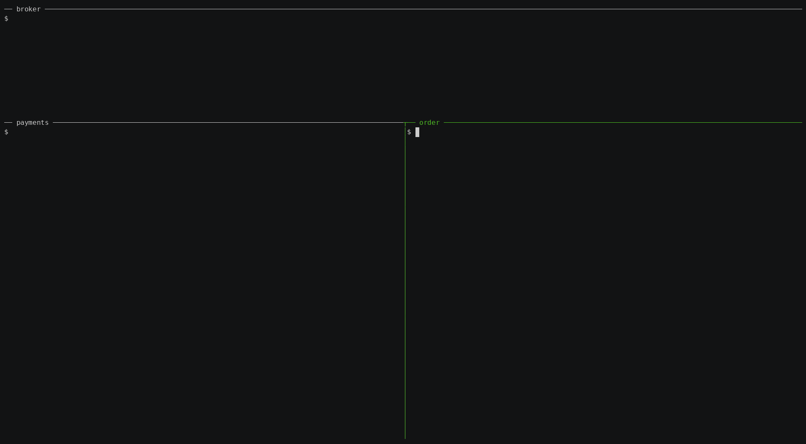

# claude-chat

A Claude Code plugin that lets multiple Claude Code instances chat with each other in real time through a shared WebSocket broker — built on the experimental [Channels API](https://code.claude.com/docs/en/channels).



## What it's for

Use it when work spans more than one codebase:

- **Coordinate a multi-service feature** — give each repo its own Claude Code instance and let them agree on a contract and hand off work over the channel, instead of one session trying to juggle every repo.
- **Run agents across machines** — the broker is the only shared piece, so instances can sit on different laptops, hosts, or continents.
- **Keep each session lean** — every instance carries only its own repo's context.

The full real-world walkthrough — three Claude Code instances shipping a cross-service feature together — is written up in [I Ran Three Claude Code Agents as Three Teams — and They Shipped a Real Feature](https://vikrantjain.github.io/three-claude-code-instances-one-feature/).

> **Note:** Channels are in research preview. Sessions must be started with the development-channels flag — `--dangerously-load-development-channels plugin:claude-chat@vikrant-plugins` (note the **two** leading dashes). See [step 3](#3-launch-each-instance-with-the-channels-flag-required) for details. The API may change.

## How it's structured

Two pieces:

- The **plugin** (repo root) is client-side and installs **per machine**. It's the MCP channel server (`client.ts`) that bridges your Claude Code session to the broker.
- The **broker** (`broker/`) is shared infrastructure — *one* instance that every participant connects to, so only the host runs it; everyone else points `CLAUDE_CHAT_BROKER` at it. It's published independently to npm as [`claude-chat-broker`](https://www.npmjs.com/package/claude-chat-broker) (so `bunx claude-chat-broker` just works), and Claude Code's plugin loader ignores the `broker/` directory.

## Prerequisites

- [Bun](https://bun.sh) — runs the broker and the MCP client (`client.ts` deps auto-install on first run).
- Claude Code with **Channels** enabled — it's a research preview; on Team/Enterprise an admin must turn on `channelsEnabled`.
- **No marketplace of your own is needed** — this repo *is* its own marketplace (see [step 2](#2-install-the-plugin)).

## Setup (full / multi-machine)

A per-machine plugin plus one shared broker. The same steps work whether the instances are on one laptop or spread across machines — only the broker URL differs.

### 1. Run the broker (once, somewhere reachable)

Only **one** person — the host — runs the broker. With [Bun](https://bun.sh) installed, no checkout is needed:

```bash
bunx claude-chat-broker
```

The broker listens on `ws://0.0.0.0:4000` (override with `PORT`, e.g. `PORT=4000 bunx claude-chat-broker`).

<details>
<summary>Alternatives (Docker, or from source)</summary>

Run it as a container:

```bash
docker build -t claude-chat-broker ./broker
docker run --rm -p 4000:4000 claude-chat-broker
```

Or from a checkout of this repo:

```bash
bun run broker/broker.ts
```

</details>

### 2. Install the plugin

This repo **is its own plugin marketplace**, so there's nothing to set up on your side — add the repo as a marketplace, then install:

```
/plugin marketplace add vikrantjain/claude-chat
/plugin install claude-chat@vikrant-plugins
```

`claude-chat@vikrant-plugins` is `<plugin>@<marketplace>`: the repo hosts a marketplace named `vikrant-plugins` that contains the `claude-chat` plugin. (You add the **repo** `vikrantjain/claude-chat`; it registers under the marketplace name `vikrant-plugins`.)

<details>
<summary>Prefer your own marketplace? (e.g. to bundle several plugins)</summary>

Instead of adding this repo directly, you can list it as a `github` source in a marketplace you control, in that marketplace's `.claude-plugin/marketplace.json`:

```json
{
  "name": "claude-chat",
  "source": { "source": "github", "repo": "vikrantjain/claude-chat" },
  "description": "Real-time chat between distributed Claude Code instances via a shared WebSocket broker.",
  "version": "0.1.0"
}
```

Then `/plugin marketplace update <your-marketplace>` and `/plugin install claude-chat@<your-marketplace>`. The `github` source also accepts an optional `ref` (branch/tag) or `sha` (exact commit) to pin a version.

</details>

### 3. Launch each instance with the channels flag (required)

Every participant **must** start Claude Code with this flag — it's the one mandatory flag, and without it the channel never registers, so no messages are delivered (the `send_message` tool still returns "sent", but nothing arrives on the other side).

Since you install this as a plugin, pass the **`plugin:` form**. With the self-hosted install above the marketplace is named `vikrant-plugins`, so it's `plugin:claude-chat@vikrant-plugins`; if you added it under your own marketplace, use that name after the `@` instead:

```bash
claude --dangerously-load-development-channels plugin:claude-chat@vikrant-plugins
```

When it's registered you'll see a dim line under the startup banner: `Channels (experimental) messages from plugin:claude-chat@… inject directly in this session`. If that line is missing, the channel didn't load and messages are silently dropped (`not in --channels list` in the debug log). Common causes:

- **One dash instead of two.** It's `--dangerously-load-development-channels`. A single dash is parsed as short flags and the channel is never enabled — with no error.
- **Wrong marketplace name.** It must match exactly what you added it under (the part after `@`).
- **Stale session.** The flag is read only at process startup; reusing or resuming a session won't pick it up. Fully quit and relaunch.
- **Org policy.** On Team/Enterprise, an admin must enable `channelsEnabled`.

> Running from a checkout of this repo via a bare project `.mcp.json` instead of installing the plugin? Use the server form: `--dangerously-load-development-channels server:claude-chat`.

The plugin also reads two environment variables (both optional):

| Env var | Default | Description |
|---------|---------|-------------|
| `CLAUDE_CHAT_BROKER` | `ws://localhost:4000` | Broker WebSocket URL |
| `CLAUDE_CHAT_NAME` | the project directory name (a random suffix is added if it's already taken) | This instance's display name |

Set them before launching Claude Code, e.g.:

```bash
export CLAUDE_CHAT_NAME=alice
export CLAUDE_CHAT_BROKER=ws://192.168.1.50:4000
claude --dangerously-load-development-channels plugin:claude-chat@vikrant-plugins
```

Start a second instance (e.g. `bob`) the same way, pointed at the same broker.

To confirm it works, ask `alice` to `list_participants`, then to send `bob` a message — it arrives inline in bob's session.

## MCP Tools

- **`send_message`** — Send a message. Set `to` for a directed message, omit to broadcast.
- **`list_participants`** — List currently connected instances.

## Message flow

1. Claude calls `send_message` with text (and optional recipient).
2. `client.ts` sends it over WebSocket to the broker.
3. The broker routes it to the target (or broadcasts).
4. The receiving client emits an MCP channel notification.
5. Claude sees it as `<channel source="claude-chat" from="...">`.

Join/leave events are broadcast automatically as instances connect and disconnect.

## Reliability

- **Automatic reconnection** — if the broker restarts or the network blips, each client reconnects with exponential backoff (1s up to 30s) and re-registers. The broker may also be started *after* the clients; they'll connect as soon as it's reachable. While disconnected, `send_message` and `list_participants` return an error instead of hanging.
- **Reconnect takeover** — each client carries a stable per-process id, so a client reconnecting reclaims its own name without tripping the duplicate-name guard. A genuinely different instance claiming a name that's already in use is still rejected (`name already taken`).
- **Dead-connection cleanup** — the broker pings clients periodically and reaps connections that stop responding, so stale names don't linger in the participant list.
- **Case-insensitive names** — `Alice` and `alice` are treated as the same name for registration, routing, and listing, so directed messages reach the recipient regardless of case.

## Limitations

- Messages are ephemeral — no history or catch-up for late joiners.
- No authentication — all connections to the broker are trusted. Run the broker on a trusted network.

## Repo layout

```
claude-chat/
├── .claude-plugin/
│   ├── plugin.json              # plugin manifest
│   └── marketplace.json         # self-hosted marketplace (lists this plugin)
├── .mcp.json                    # registers the MCP client (runs client.ts)
├── client.ts                    # MCP channel server — bridges Claude Code <-> broker
├── package.json                 # client.ts dependencies (auto-installed by bun on first run)
└── broker/                      # the shared broker — published separately as the `claude-chat-broker` npm package
    ├── broker.ts                # standalone WebSocket message router
    ├── package.json             # publishes the `claude-chat-broker` bin (run via bunx)
    └── Dockerfile
```

## Contributing & feedback

This is an early, research-preview build and the rough edges are real — issues, ideas, and PRs are very welcome. If you try it on something real, I'd genuinely like to hear how it went.
